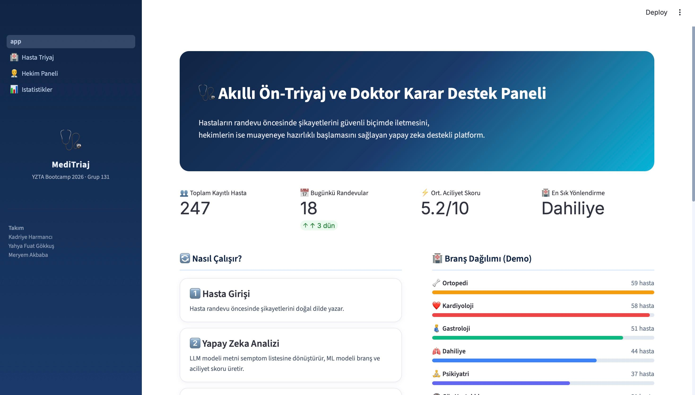
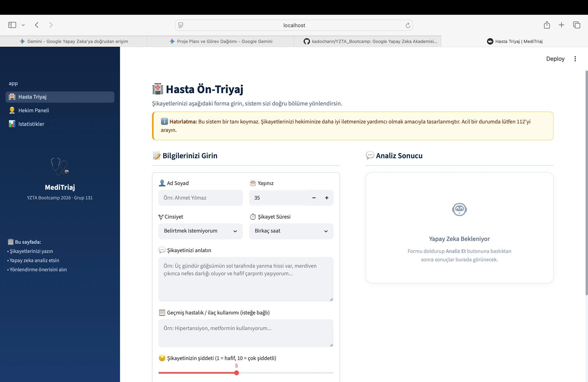
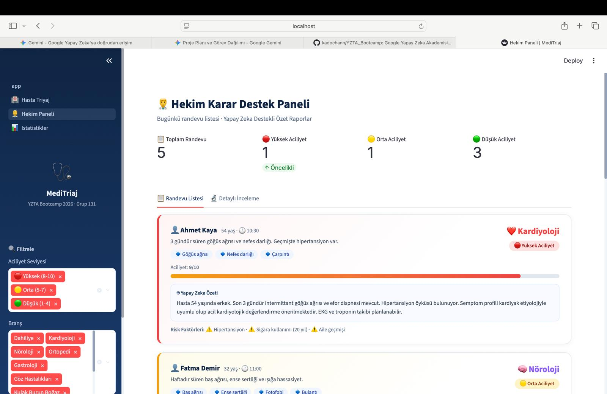
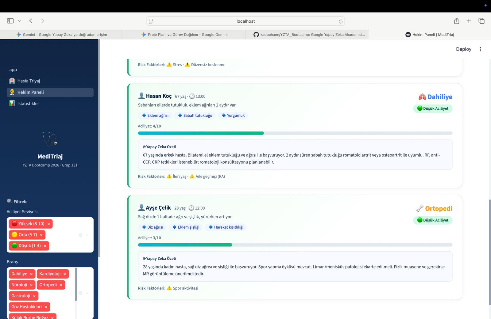
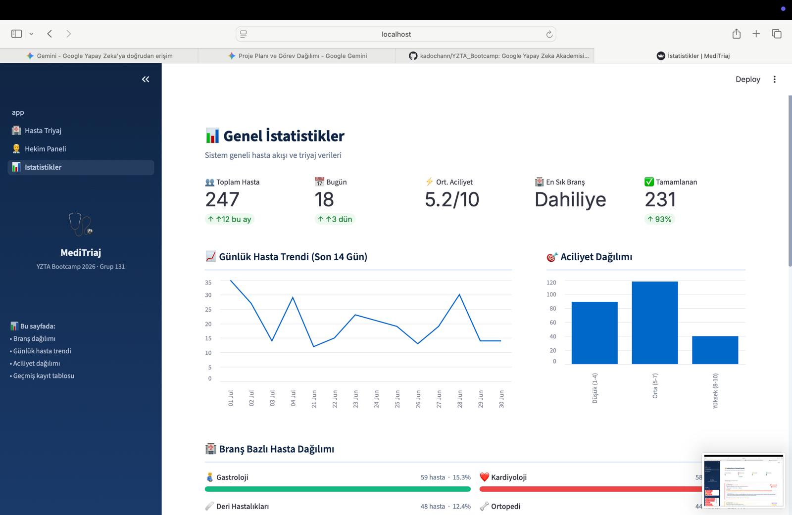
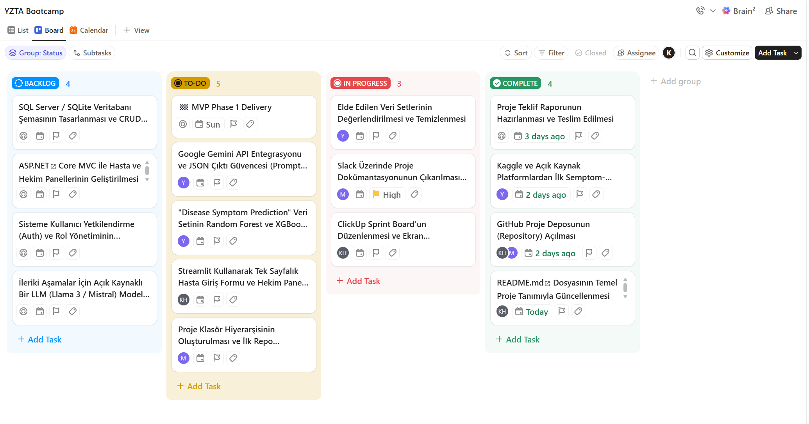

# 🩺 Akıllı Ön-Triyaj ve Doktor Karar Destek Paneli
### 🚀 YZTA Bootcamp 2026 - Grup 131 Proje Prototipi (MVP Phase 1)

Bu proje, **Yapay Zeka ve Teknoloji Akademisi (YZTA) Bootcamp 2026 - 5. Akademi Dönemi** kapsamında, Grup 131 tarafından geliştirilen yapay zeka destekli bir ön-triyaj ve klinik karar destek sistemi prototipidir. 

Projenin temel amacı; hastaların randevu öncesinde şikâyetlerini doğal dilde ifade edebileceği kontrollü bir arayüz sunmak, bu şikâyetleri yapılandırılmış verilere dönüştürerek klasik makine öğrenmesi modelleriyle olası branş ve aciliyet skorunu tahmin etmek ve hekime muayene öncesinde hazırlık şansı tanıyan dinamik bir özet panel üretmektir.

---

## 🎯 Temel Özellikler (MVP Kapsamı)
* **Yapay Zeka Destekli Metin Analizi:** Google Gemini API kullanılarak hastanın doğal dildeki şikayetinden tıbbi semptomların sıfır hata ile JSON formatında ayıklanması.
* **Akıllı Branş ve Aciliyet Tahmini:** `scikit-learn` (Random Forest / XGBoost) modelleriyle semptomlar üzerinden poliklinik yönlendirmesi ve 1-10 arası aciliyet skoru üretimi.
* **Hafif ve Hızlı Arayüz (Streamlit):** Hem hasta giriş ekranını hem de hekim karar destek panelini tek bir Python ekosisteminde birleştiren kullanıcı dostu arayüz.
* **Etik Yapay Zeka Yaklaşımı:** Kesinlikle tanı koymayan, "ön bilgilendirme amaçlı karar destek verisidir" uyarısı barındıran klinik sınır koruması.

---

## 🏗️ Proje Klasör Mimarisi

```text
SmartTriage_Grup131/
│
├── data/                   # Kaggle'dan edinilen ham ve işlenmiş veri setleri (.csv)
├── notebooks/              # Keşifçi Veri Analizi (EDA) ve Model Eğitim Jupyter Notebook'ları
├── models/                 # Eğitilmiş makine öğrenmesi modelleri (.pkl / .joblib)
├── src/                    # Ana Kaynak Kod Klasörü
│   ├── ml/                 # Model yükleme ve tahmin (predict) fonksiyonları
│   ├── llm/                # Gemini API entegrasyonu ve prompt mühendisliği katmanı
│   └── ui/                 # Streamlit arayüz kodları (app.py)
├── assets/                 # README dökümantasyonunda kullanılan ekran görüntüleri
├── .env                    # API Anahtarları ve gizli değişkenler (Git'e pushlanmaz!)
├── .gitignore              # Proje dışı tutulacak dosya filtreleri
├── requirements.txt        # Proje bağımlılıkları ve Python paketleri
└── README.md               # Proje ana dökümantasyonu
```

## Uygulama Arayüzü ve Ekran Görüntüleri
### 1. Karşılama Ekranı & Genel Bakış
Sistemin çalışma mantığının, hasta istatistiklerinin ve demo branş dağılım grafiklerinin yer aldığı ana karşılama arayüzü:


###  2. Hasta Ön-Triyaj Giriş Paneli
Hastanın yaş, şikayet süresi, şiddeti ve doğal dildeki tıbbi durumunu girdiğinde arkada Gemini API ve ML modelini tetikleyen kullanıcı veri giriş formu:


###  3. Hekim Karar Destek Paneli (Detaylı Özet ve Filtreleme)
Hekimlerin randevudan önce hastanın durumunu analiz etmesini sağlayan, risk faktörlerini listeleyen ve Gemini API tarafından üretilen "Yapay Zeka Özeti" modülünü içeren akıllı panel


Filtreleme mekanizması sayesinde aciliyet seviyesine ve poliklinik branşına göre hasta listesi dinamik olarak daraltılabilmektedir:


### 4. Genel İstatistikler ve Klinik Analiz Paneli
Klinik yönetiminin günlük hasta trendini, aciliyet dağılımlarını ve branş bazlı yoğunlukları izleyebileceği veri görselleştirme alanı:


## 🔄 Scrum Süreci ve Sprint Yönetimi
Projemiz, Scrum metodolojisine uygun olarak yönetilmektedir. İş takibi, backlog yönetimi ve sprint tahtası için ClickUp kullanılmıştır.

## 📅 Sprint 1 (İlk Aşama Teslimi - 5 Temmuz)
**Hedef:** Hızlı prototipleme amacıyla Streamlit üzerinde uçtan uca çalışan (End-to-End) MVP'nin ayağa kaldırılması, LLM JSON entegrasyonunun tamamlanması ve temel ML modelinin arayüze bağlanması.

Projemiz, Scrum metodolojisine uygun olarak yönetilmektedir. İş takibi, backlog yönetimi ve sprint tahtası için ClickUp kullanılmıştır. İlk sprint kapsamında projenin **arayüz (UI) prototipi** tasarlanmış ve veri akış simülasyonu uçtan uca ayağa kaldırılmıştır.

### 1. Backlog Düzeni ve Story Seçimleri (User Stories)
Sprint 1 kapsamında kullanıcı odaklı geliştirme yapabilmek adına iş listemiz (Backlog) aşağıdaki Kullanıcı Hikayelerine (User Stories) bölünmüş ve ClickUp üzerinde önceliklendirilmiştir:

*   **US-01 (Hasta Formu):** Bir *Hasta* olarak, randevu öncesinde şikayetlerimi doğal dilde yazabileceğim ve yaş/süre gibi bilgileri girebileceğim temiz bir form arayüzü istiyorum, böylece klinik süreçlerimi kolayca başlatabilmeyi hedefliyorum. *(Durum: Tamamlandı - 5 SP)*
*   **US-02 (Hekim Paneli):** Bir *Hekim* olarak, randevu öncesinde hastaların şikayet özetlerini ve tahmini branş/aciliyet skorlarını simüle eden dinamik bir filtreleme paneli görmek istiyorum, böylece muayene öncesi hazırlık sürimi kısaltmayı amaçlıyorum. *(Durum: Tamamlandı - 5 SP)*
*   **US-03 (Analiz Ekranı):** Bir *Klinik Yöneticisi* olarak, günlük hasta yoğunluğunu ve aciliyet dağılımlarını izleyebileceğim grafiksel bir analiz ekranı istiyorum, böylece hastane kaynak planlamasını optimize etmek istiyorum. *(Durum: Tamamlandı - 3 SP)*

#### Sprint 1 Hedefleri

Sprint 1 kapsamında, gerçek model entegrasyonu öncesinde sistemin çalışma mantığını doğrulayacak ve uçtan uca veri akışını simüle edecek dinamik bir UI prototipi (MVP Phase 1) geliştirilmesi hedeflenmiştir:
*   Hasta Formu Hedefi: Hastaların randevu öncesinde şikayetlerini doğal dilde yazabileceği, yaş ve süre gibi temel verileri girebileceği kullanıcı dostu bir ön-triyaj giriş formunun tasarlanması. *(Tamamlandı)*
*   Hekim Paneli Hedefi: Hekimlerin muayene öncesinde hastaların durumunu analiz edebilmesi için simüle edilmiş branş/aciliyet skorlarını ve risk faktörlerini içeren dinamik bir filtreleme arayüzünün oluşturulması. *(Tamamlandı)*
*   Klinik Analiz Hedefi: Hastane yönetiminin günlük hasta yoğunluğunu, aciliyet dağılımlarını ve trendleri grafiksel olarak izleyebileceği bir genel istatistik panelinin ayağa kaldırılması. (Tamamlandı)




### 2. Daily Scrum (Günlük Senkronizasyon)
Sprint boyunca ekibimiz düzenli aralıklarla bir araya gelerek süreç takibi yapmış ve aşağıdaki 3 temel soruya yanıt aramıştır:
1. *Dün ne yaptım?* | 2. *Bugün ne yapacağım?* | 3. *Önümde bir engel (Blocker) var mı?*

*   **Kadriye (Scrum Master):** ClickUp üzerindeki iş paketlerini organize etti, sayfa geçişleri ve arayüz içi veri akış mimarisinin planlamasını tamamladı. *Engeli yok.*
*   **Yahya Fuat (Product Owner):** Prompt tasarımlarının mantıksal şemasını çıkardı ve Streamlit üzerinde gösterilecek demo/simülasyon verilerinin yapılandırılmasını sağladı. *Engeli yok.*
*   **Meryem (Developer):** Simüle edilmiş verilerle çalışan Streamlit UI ekranlarını (Hasta Girişi, Hekim Paneli, İstatistikler) kodladı ve teknik dokümantasyonu hazırladı. *Engeli yok.*


### 3. Sprint Review (Sprint Değerlendirmesi ve Demo)
*   **Sprint Hedefi:** Streamlit üzerinde, simüle edilmiş verilerle uçtan uca çalışan ve tüm ekranları (Hasta, Hekim, Yönetim) içeren bir MVP (Minimum Uygulanabilir Ürün) UI prototipinin ayağa kaldırılması.
*   **Çıktı Değerlendirmesi:** Belirlenen hedefe %100 oranında ulaşıldı. Gerçek model entegrasyonu öncesinde sistemin nasıl çalışacağını gösteren kullanıcı dostu arayüz tasarımı başarıyla tamamlandı ve akademinin incelemesine sunuldu.

### 4. Sprint Retrospective (Kapanış ve Değerlendirme)
Sprint 1 sonunda takım olarak gerçekleştirdiğimiz süreç değerlendirme toplantısı sonuçları:

*   **Neleri İyi Yaptık? (What went well?):** Ekip içi görev dağılımı çok netti. Kodlama sürecine geçmeden önce ekran tasarımlarını hızlıca netleştirmek Streamlit geliştirme sürecini ciddi oranda hızlandırdı.
*   **Neler Geliştirilebilir? (What can be improved?):** İlk aşamada arayüze odaklandığımız için gerçek verilerin analizine daha az vakit ayırdık. Bir sonraki sprintte veri analitiği kısmına daha erken başlamalıyız.
*   **Sprint 2 Aksiyon Planı (Action Items):** Gelecek sprintte Kaggle veri setlerinin temizlenerek Scikit-Learn modellerinin (Random Forest / XGBoost) eğitilmesi ve bu aşamada kurulan Streamlit UI yapısına entegre edilmesi önceliklendirilecektir.

## 👥 Ekip ve Görev Dağılımı (Grup 131)

- <b>Kadriye HARMANCI:</b> Scrum Master / Yapay Zeka Geliştiricisi (ClickUp Sprint Board yönetimi, veri akış entegrasyonu).
- <b>Yahya Fuat GÖKKUŞ:</b> Product Owner / Veri Analizcisi (Gemini API Entegrasyonu, Prompt Tasarımı ve Scikit-Learn Model Eğitimi).
- <b>Meryem AKBABA:</b> Developer / Dokümantasyon Sorumlusu (Slack/Git süreçlerinin yönetimi, Streamlit UI tasarımı,dosya hiyerarşisinin takibi ve teknik dökümantasyon).

## ⚠️ Etik Not ve Sorumluluk Reddi
Bu sistem kesinlikle bir tanı koyma aracı değildir. Sistem tarafından üretilen branş önerileri ve aciliyet skorları, yalnızca hastanın randevu öncesinde durumunu özetlemek ve hekime klinik karar destek mekanizması sunmak amacıyla geliştirilmiş deneysel bir prototiptir. Nihai tıbbi karar ve teşhis yetkisi tamamen uzman hekime aittir.
